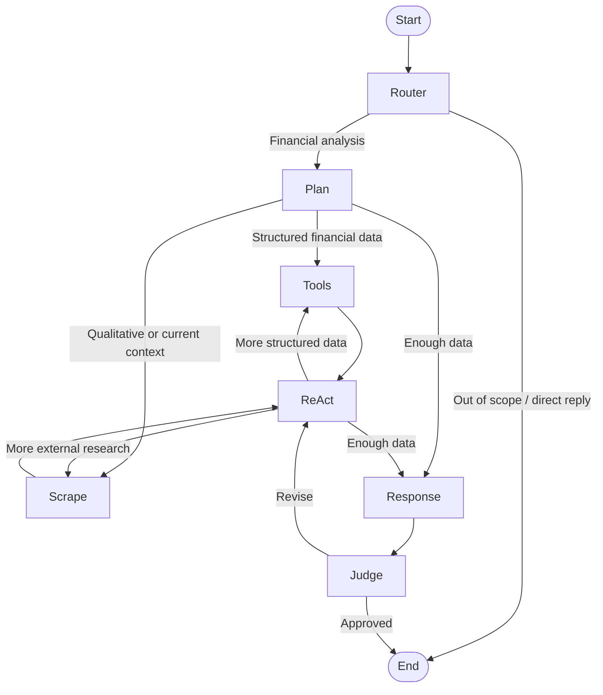

# BaboonTechnologiesProject

An equity research agent for US public companies. Ask about a company and it pulls filings from SEC EDGAR, runs valuation and ratio calculations deterministically through tools, and returns a sourced analysis—including an explicit account of what it could not compute and why. A judge node evaluates every response before release and can send it back for revision.

**Status:** working prototype. Deployable to Render and Vercel (see [DEPLOYMENT.md](DEPLOYMENT.md)), but not hardened for production and not intended to inform investment decisions.

The agent is model-agnostic. See [LLM_COMPATIBILITY.md](LLM_COMPATIBILITY.md) for supported providers, model requirements, and configuration examples.

> **Disclaimer:** LLMs are stochastic, which creates a risk of hallucinations. Even though calculations are performed deterministically through tools, the LLM can still ignore or misinterpret their results.

> **Setup at a glance:** the app can run with a single paid LLM API key by assigning every node to a compatible model from that provider. Reproducing the default OpenAI + Anthropic routing requires two paid keys. FRED and Supabase offer free access, and `EDGAR_USER_AGENT` is only the email address the SEC requires for request identification. Allow about 15 minutes for account and environment setup.

## Agent Architecture

The agent separates routing, data collection, synthesis, and quality control into specialized nodes. If the judge finds a material reasoning flaw, it sends the response back through the ReAct node so the agent can gather missing evidence and rewrite the answer before releasing it.



### Model Routing

Each node can use a different provider and model. The defaults put stronger models on high-leverage reasoning and evaluation steps while keeping external query generation cost-controlled.

| Nodes | Default model | Architectural role |
|---|---|---|
| Router, Plan, ReAct, Judge | `gpt-4.1` | Structured routing, tool planning, completeness checks, and response evaluation |
| Response | `claude-sonnet-4-6` | Final financial synthesis and grounded interpretation |
| Scrape | `gpt-5.4-mini` | Cost-controlled query generation for external research |

Every assignment is configurable through the corresponding `<NODE>_LLM_PROVIDER` and `<NODE>_LLM_MODEL` environment variables; see [LLM_COMPATIBILITY.md](LLM_COMPATIBILITY.md).

## Requirements

You need to install these before starting. If you already have them, skip this step.

1. **Visual Studio Code** (Recommended) — the program you will open the project in. Download: [code.visualstudio.com/download](https://code.visualstudio.com/download)
2. **uv** — runs the backend. Download: [docs.astral.sh/uv/getting-started/installation](https://docs.astral.sh/uv/getting-started/installation/)
3. **Node.js** — runs the frontend. Download the "LTS" version: [nodejs.org/en/download](https://nodejs.org/en/download)

After installing, close Visual Studio Code and open it again so it detects the new programs.

## Download the Project

1. Go to [github.com/smith8jas/BaboonTechnologiesProject](https://github.com/smith8jas/BaboonTechnologiesProject)
2. Click the green "Code" button, then click "Download ZIP"
3. Find the downloaded file and unzip it. On Windows, right click it and choose "Extract All". On macOS, double click it.
4. Move the unzipped folder somewhere you will remember, like Desktop or Documents
5. Open Visual Studio Code, click File → Open Folder, and select the folder you unzipped

If you already have Git installed, you can replace all of the above with one command: `git clone https://github.com/smith8jas/BaboonTechnologiesProject.git`

## Setup Instructions

### Backend

1. Open backend and identify the .env.example file
2. Create a .env file inside the backend folder where the .env.example file is located and copy the contents in the .env.example file into the new .env file
3. Acquire your keys. Open the following links for each key:

   - `EDGAR_USER_AGENT` — This is not a key. Write your own email address here. The SEC requires it to let you download filings.
   - `FRED_API_KEY` — Go to [fredaccount.stlouisfed.org/apikeys](https://fredaccount.stlouisfed.org/apikeys), create a free account, and click "Request API Key". Copy the key it gives you.
   - `OPENAI_API_KEY` — Go to [platform.openai.com/api-keys](https://platform.openai.com/api-keys), create an account, add a payment method, then click "Create new secret key". Copy it immediately — it is only shown once. This key alone is sufficient if every node uses compatible OpenAI models.
   - `ANTHROPIC_API_KEY` — Optional for a single-provider setup. It is required to reproduce the default routing, where Anthropic writes the final response. Go to [console.anthropic.com/settings/keys](https://console.anthropic.com/settings/keys), create an account, add a payment method, then click "Create Key". Copy it immediately — it is only shown once.
   - `SUPABASE_URL`, `SUPABASE_ANON_KEY`, `SUPABASE_SERVICE_ROLE_KEY` — Go to [supabase.com/dashboard](https://supabase.com/dashboard), create a free account and a new project. Wait for it to finish setting up, then open Project Settings → API. Copy the "Project URL", the `anon` key, and the `service_role` key.

4. Fill in your keys in the .env file
   - For quality performance and to minimize the risk of hallucinations, the following minimum model requirements are needed for each node. This is especially important for the router node, which acts as a safety node, and the response node, which performs the analysis:
      - ROUTER_LLM_MODEL= gpt-4.1 or similar
      - PLAN_LLM_MODEL= gpt-4.1 or similar
      - REACT_LLM_MODEL= gpt-4.1 or similar
      - RESPONSE_LLM_MODEL= claude-sonnet-4-6 or similar
      - JUDGE_LLM_MODEL= gpt-4.1 or similar
      - SCRAPE_LLM_MODEL= gpt-5.4-mini or similar

   To run with only an OpenAI LLM key, keep the OpenAI defaults and route the response node to OpenAI in `.env`:

   ```dotenv
   RESPONSE_LLM_PROVIDER=openai
   RESPONSE_LLM_MODEL=gpt-4.1
   ```

   In this setup, `ANTHROPIC_API_KEY` can be left empty. See [LLM_COMPATIBILITY.md](LLM_COMPATIBILITY.md) before choosing a different single provider because the routing nodes require structured output and tool calling.

### Frontend

1. Open frontend and identify the .env.example file
2. Create a .env file inside the frontend folder where the .env.example file is located and copy the contents in the .env.example file into the new .env file
3. Acquire your keys:

   - `VITE_API_BASE_URL` — Leave it exactly as it is: `http://localhost:8000`
   - `VITE_SUPABASE_URL` — The same "Project URL" you copied for the backend
   - `VITE_SUPABASE_ANON_KEY` — The same `anon` key you copied for the backend. Do not use the `service_role` key here.

4. Fill in your keys in the .env file

### Database

Your Supabase project starts empty. These steps create the tables the app needs to save accounts
and chats. You only do this once.

1. Go to [supabase.com/dashboard](https://supabase.com/dashboard) and open your project
2. Click "SQL Editor" in the left sidebar, then click "New query"
3. Open the file `backend/supabase/migrations/001_auth_chat_schema.sql`, copy everything inside it, paste it into the editor, and click "Run"
4. Open the file `backend/supabase/migrations/002_profile_fields.sql`, copy everything inside it, paste it into the editor, and click "Run"

## How to Run the Code

Text in `code format` is what you type into the terminal.

### Full Application

1. Open a terminal (Windows/Linux:`CTRL ñ` - macOS:`Cmd ñ`)
2. Open backend: `cd backend`
3. Install dependencies: `uv sync`
4. Run the backend: `uv run uvicorn backend.main:app --reload`

5. Open new terminal (Do not close current terminal)
6. Open frontend: `cd frontend`
7. Install: `npm install`
8. Run App: `npm run dev`

9. The last command prints a web address in the terminal, usually `http://localhost:5173`. Open it in your browser.

### Backend for Debugging

This runs `backend/src/backend/agent/main.py` and prints its output in the terminal.

1. Open a terminal (Windows/Linux:`CTRL ñ` - macOS:`Cmd ñ`)
2. Open backend: `cd backend`
3. Install dependencies: `uv sync`
4. Run file: `uv run python src/backend/agent/main.py`

## Structure

- `frontend/`: React and Vite chat interface, authentication flows, and report export
- `backend/src/backend/api/`: FastAPI routes, schemas, and controllers
- `backend/src/backend/agent/nodes/`: Router, planner, tools, scraper, ReAct, response, and judge nodes
- `backend/src/backend/agent/edges/`: Conditional routing between agent nodes
- `backend/src/backend/agent/tools/`: Research and deterministic calculation tools
- `backend/src/backend/agent/cache/`: Financial-data cache, catalog, and merge behavior
- `backend/src/backend/agent/streaming/`: Agent progress and response streaming events
- `backend/src/backend/adapters/`: SEC EDGAR, FRED, Yahoo Finance, and Damodaran integrations
- `backend/src/backend/services/`: Financials, ratios, growth, comparables, and DCF services
- `backend/supabase/migrations/`: Database schema for authentication, profiles, and chats

## Documentation

- [TECHNICAL_OVERVIEW.md](TECHNICAL_OVERVIEW.md): How the program works and what its limitations are
- [LLM_COMPATIBILITY.md](LLM_COMPATIBILITY.md): Which AI providers work and how to change the models
- [DEPLOYMENT.md](DEPLOYMENT.md): Putting the app online with Render and Vercel
- [GitWorkflow.md](GitWorkflow.md): Branch and commit conventions

## If Something Fails

**The terminal says `'uv' is not recognized` or `'npm' is not recognized`**

The program is not installed, or the terminal was opened before you installed it. Install it from
the Requirements section, then close Visual Studio Code completely and open it again.

**The terminal says `No such file or directory` when you type `cd backend`**

You opened the wrong folder. In Visual Studio Code, click File → Open Folder and select the
project folder — the one that contains the `backend` and `frontend` folders inside it.

**The backend does not start and mentions a missing field or setting**

Your .env file is missing, in the wrong place, or named wrong. It must be inside the `backend`
folder, next to the .env.example file, and named exactly `.env` — not `.env.txt` and not
`env`. Check that every line from .env.example is present and filled in.

**The web page opens but says the backend is offline**

The backend terminal is not running. Go back to the first terminal and check it is still showing
the backend. If you closed it, run steps 2 to 4 of Full Application again. Keep both terminals
open the whole time you use the app.

**You cannot create an account, or your chats do not save**

You skipped the Database section. Run the two .sql files in Supabase, then reload the page.

**The chat answers for a while and then fails at the end**

With the default model routing, `ANTHROPIC_API_KEY` writes the final answer. Check that the key is
valid and funded, or use the single-provider configuration above, then restart the backend.

**The chat fails immediately with a key or authentication error**

`OPENAI_API_KEY` is missing, wrong, or the account has no credit. Check it in the backend .env
file, then restart the backend.

**The terminal says the port is already in use**

The backend or frontend is already running in another terminal. Find that terminal and press
`CTRL C` to stop it, then try again.

**The first question takes a long time to answer**

This is normal. The program loads everything it needs on the first question. The following ones
are faster.
